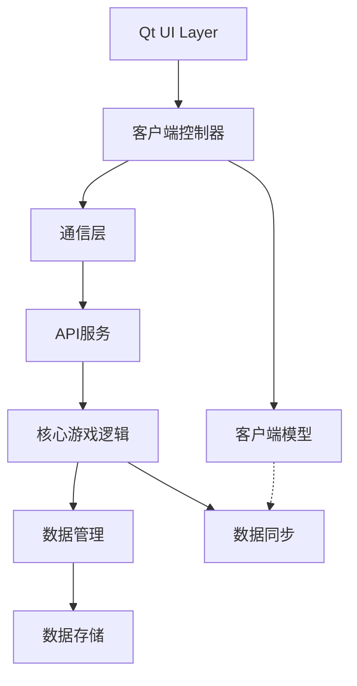

# 《幻境传说》游戏开发设计方案（前后端分离架构）

---

## **一、项目概述**

### **1.1 项目背景**
- **项目名称**：幻境传说 (Fantasy Legend)
- **游戏类型**：2D动作角色扮演游戏（ARPG）
- **开发目标**：3个月内完成一款中等技术难度的2D游戏（支持简单3D元素）
- **目标平台**：Windows（前端），跨平台（后端）
- **开发团队**：单人开发
- **游戏时长**：主线20-30小时，完整内容50+小时

### **1.2 游戏特色**
- **丰富的剧情系统**：6个主线章节，50+支线任务，多重结局
- **策略战斗系统**：连击、元素克制、状态效果
- **角色成长**：3种职业，技能树，装备强化
- **动态世界**：NPC关系系统，世界状态变化
- **前后端分离**：灵活的架构设计，便于扩展和维护

### **1.3 核心功能**
- **Qt前端UI设计**：菜单、地图、角色状态面板、战斗界面
- **C++后端逻辑**：游戏规则、物理模拟、AI系统
- **前后端通信**：HTTP API和WebSocket实时通信
- **数据持久化**：SQLite数据库系统

---

## **二、技术选型**

### **2.1 前端（Qt）**
#### **UI框架**
- **QML + C++ 后端**：动态UI设计（动画、交互）
- **Qt Quick 3D**：简单3D效果（角色模型展示）
- **Qt Widgets**：传统界面组件（设置、编辑器）

#### **渲染优化**
- **QQuickItem** / **QGraphicsView**：实现2D渲染
- **QOpenGLWidget**：提升性能，支持硬件加速
- **QPainter**：自定义绘制，特效渲染

#### **界面设计**
```qml
// 主界面布局示例
ApplicationWindow {
    id: mainWindow
    width: 1280
    height: 720
    visible: true
    title: "幻境传说"
    
    // 主游戏区域
    GameScene {
        id: gameScene
        anchors.fill: parent
        anchors.rightMargin: 300
    }
    
    // 右侧UI面板
    UIPanel {
        id: uiPanel
        anchors.right: parent.right
        anchors.top: parent.top
        anchors.bottom: parent.bottom
        width: 300
    }
}
```

### **2.2 后端（C++）**
#### **核心模块**
- **游戏逻辑引擎**：C++实现战斗系统、任务触发
- **数据管理**：SQLite数据库系统
- **API服务**：RESTful API和WebSocket服务
- **配置管理**：JSON配置文件解析

#### **架构设计**
```cpp
// 游戏引擎核心类
class GameEngine : public QObject {
    Q_OBJECT
    
public:
    static GameEngine* instance();
    
    // 游戏状态管理
    void startGame();
    void pauseGame();
    void resumeGame();
    void saveGame();
    void loadGame();
    
    // 场景管理
    void switchScene(const QString& sceneName);
    void loadLevel(int levelId);
    
    // 事件系统
    void emitEvent(const QString& eventName, const QVariantMap& data);
    
signals:
    void gameStateChanged(GameState state);
    void levelCompleted(int levelId);
    void playerLevelUp(int newLevel);
    
private:
    GameState m_currentState;
    QTimer* m_gameTimer;
    QVariantMap m_gameData;
};
```

### **2.3 通信层**
#### **API设计**
- **RESTful API**：用于非实时数据交换
- **WebSocket**：用于实时数据交换
- **JSON格式**：数据交换格式

#### **通信示例**
```json
// 角色信息请求
GET /api/character/123

// 响应
{
  "message_id": "uuid",
  "message_type": "character_info",
  "timestamp": 1623456789,
  "data": {
    "id": "123",
    "name": "勇者",
    "class": "warrior",
    "level": 10,
    "health": 100,
    "max_health": 100
  }
}
```

### **2.4 数据存储**
#### **数据库设计**
- **SQLite**：轻量级关系型数据库
- **核心表**：角色、技能、装备、物品、任务、关卡
- **关联表**：角色技能、角色装备、角色背包、角色任务

#### **数据模型**
```cpp
struct CharacterData {
    std::string id;
    std::string name;
    std::string characterClass;
    int level;
    int experience;
    int health;
    int maxHealth;
    // 其他属性
};
```

---

## **三、技术架构设计**

### **3.1 整体架构图**
```
┌─────────────────────────────────────────────────────────────┐
│                      客户端 (Client)                         │
├─────────────────────────────────────────────────────────────┤
│  Qt UI Layer (QML/Qt Widgets)  │  客户端控制器               │
│  • 主菜单界面                  │  • 游戏控制器               │
│  • 游戏场景                    │  • 输入控制器               │
│  • 角色界面                    │  • 网络控制器               │
│  • 设置界面                    │  • 资源控制器               │
│  • 背包界面                    │  • 音频控制器               │
├─────────────────────────────────────────────────────────────┤
│                      通信层 (Communication)                  │
│  • HTTP客户端                  │  • WebSocket客户端          │
│  • JSON序列化/反序列化         │  • 认证管理                 │
├─────────────────────────────────────────────────────────────┤
│                      服务端 (Server)                         │
├─────────────────────────────────────────────────────────────┤
│  核心游戏逻辑                  │  数据管理                   │
│  • 游戏引擎                    │  • 数据库管理器             │
│  • 战斗系统                    │  • 配置管理器               │
│  • 角色系统                    │  • 存档管理器               │
│  • 任务系统                    │  • 资源管理器               │
│  • 关卡系统                    │  • 日志系统                 │
├─────────────────────────────────────────────────────────────┤
│  API服务                       │  数据存储                   │
│  • RESTful API                 │  • SQLite数据库             │
│  • WebSocket服务               │  • JSON配置文件             │
│  • 认证服务                    │  • 文件存储                 │
└─────────────────────────────────────────────────────────────┘
```

### **3.2 模块依赖关系**


### **3.3 数据流设计**
```
用户输入 → Qt UI → 客户端控制器 → 通信层 → API服务 → 核心游戏逻辑 → 数据管理 → 数据存储
    ↑         ↑        ↑           ↑         ↑           ↑             ↑           ↓
    └─────────┴────────┴───────────┴─────────┴───────────┴─────────────┴───────────┘
                                  响应/事件流
```

---

## **四、目录结构**

```
Fantasy_Legend/
├── client/                        # 前端目录
│   ├── assets/                   # 前端资源文件
│   │   ├── images/              # 图片资源
│   │   ├── audio/               # 音频资源
│   │   ├── ui/                  # UI资源(QML文件)
│   │   └── fonts/               # 字体资源
│   ├── include/                  # 前端头文件
│   │   ├── ui/                  # UI相关头文件
│   │   │   ├── windows/        # 窗口类
│   │   │   ├── scenes/         # 场景类
│   │   │   ├── components/     # UI组件
│   │   │   └── managers/       # UI管理器
│   │   ├── models/              # 前端数据模型
│   │   ├── controllers/         # 前端控制器
│   │   ├── network/             # 网络通信
│   │   └── utils/               # 工具类
│   ├── src/                      # 前端源代码
│   │   ├── main.cpp             # 程序入口
│   │   ├── ui/                  # UI实现
│   │   ├── models/              # 模型实现
│   │   ├── controllers/         # 控制器实现
│   │   ├── network/             # 网络实现
│   │   └── utils/               # 工具类实现
│   ├── config/                   # 前端配置文件
│   └── CMakeLists.txt            # 前端CMake配置
│
├── server/                        # 后端目录
│   ├── include/                  # 后端头文件
│   │   ├── core/                # 核心逻辑头文件
│   │   │   ├── characters/      # 角色系统
│   │   │   ├── combat/          # 战斗系统
│   │   │   ├── skills/          # 技能系统
│   │   │   ├── items/           # 物品系统
│   │   │   ├── quests/          # 任务系统
│   │   │   └── levels/          # 关卡系统
│   │   ├── data/                # 数据管理头文件
│   │   │   ├── database/        # 数据库管理
│   │   │   ├── config/          # 配置管理
│   │   │   └── save/            # 存档管理
│   │   ├── api/                 # API接口头文件
│   │   └── utils/               # 工具类头文件
│   ├── src/                      # 后端源代码
│   │   ├── main.cpp             # 后端入口
│   │   ├── core/                # 核心实现
│   │   ├── data/                # 数据实现
│   │   ├── api/                 # API实现
│   │   └── utils/               # 工具实现
│   ├── config/                   # 后端配置文件
│   ├── scripts/                  # 数据库脚本
│   └── CMakeLists.txt            # 后端CMake配置
│
├── common/                        # 前后端共享代码
│   ├── include/                  # 共享头文件
│   │   ├── protocol/            # 通信协议
│   │   ├── models/              # 共享数据模型
│   │   └── utils/               # 共享工具
│   ├── src/                      # 共享源代码
│   └── CMakeLists.txt            # 共享代码CMake配置
│
├── tools/                         # 开发工具
│   ├── python/                   # Python工具
│   │   ├── generators/          # 生成器
│   │   ├── database/            # 数据库工具
│   │   └── testing/             # 测试工具
│   ├── editors/                  # 编辑器工具
│   └── scripts/                  # 构建脚本
│
├── docs/                          # 文档
│   ├── api/                      # API文档
│   ├── design/                   # 设计文档
│   └── user/                     # 用户文档
│
├── tests/                         # 测试
│   ├── end_to_end/               # 端到端测试
│   └── performance/              # 性能测试
│
└── CMakeLists.txt                 # 主CMake配置
```

---

## **五、前后端通信协议**

### **5.1 通信方式**
- **HTTP API**：用于非实时数据交换
- **WebSocket**：用于实时数据交换

### **5.2 消息格式**
```json
{
  "message_id": "唯一消息ID",
  "message_type": "消息类型",
  "timestamp": 1623456789,
  "data": {
    // 具体数据
  }
}
```

### **5.3 API端点示例**
| 端点 | 方法 | 描述 |
|------|------|------|
| `/api/character/{id}` | GET | 获取角色信息 |
| `/api/character/{id}/level-up` | POST | 角色升级 |
| `/api/combat/start` | POST | 开始战斗 |
| `/api/combat/{id}/skill` | POST | 使用技能 |
| `/api/character/{id}/inventory` | GET | 获取背包 |
| `/api/character/{id}/quests` | GET | 获取任务列表 |

### **5.4 WebSocket事件示例**
| 事件类型 | 描述 |
|---------|------|
| `character_update` | 角色状态更新 |
| `combat_turn` | 战斗回合更新 |
| `enemy_action` | 敌人行动 |
| `quest_progress` | 任务进度更新 |

---

## **六、核心系统设计**

### **6.1 战斗系统**
- **混合战斗模式**：实时操作 + 策略思考
- **连击系统**：连续攻击提升伤害和效果
- **元素系统**：火、冰、雷、风、土、光、暗七种元素
- **状态系统**：增益、减益、控制效果

### **6.2 角色系统**
- **角色属性**：等级、经验、生命值、魔法值、攻击力、防御力等
- **技能系统**：主动技能、被动技能、技能树
- **装备系统**：武器、防具、饰品等

### **6.3 数据库系统**
- **核心表**：角色表、技能表、装备表、物品表、任务表、关卡表等
- **关联表**：角色技能关联、角色装备关联、角色背包等
- **记录表**：战斗记录、状态效果、游戏存档等

---

## **七、开发流程**

### **7.1 前端开发流程**
1. **UI设计**：设计界面原型和交互流程
2. **组件开发**：实现UI组件和界面
3. **控制器开发**：实现前端逻辑控制
4. **网络集成**：与后端API集成
5. **测试与优化**：UI测试和性能优化

### **7.2 后端开发流程**
1. **数据库设计**：设计数据库结构
2. **核心逻辑实现**：实现游戏核心系统
3. **API开发**：实现API接口
4. **数据管理**：实现数据持久化
5. **测试与优化**：单元测试和性能优化

### **7.3 集成测试**
1. **前后端集成**：确保前后端通信正常
2. **功能测试**：测试完整游戏功能
3. **性能测试**：测试系统性能和稳定性
4. **用户测试**：收集用户反馈

---

## **八、部署方案**

### **8.1 前端部署**
- **Windows安装包**：使用Qt Installer Framework或NSIS创建安装包
- **自动更新**：实现自动检查和下载更新功能

### **8.2 后端部署**
- **单机模式**：后端作为本地服务运行
- **服务器模式**：后端部署到服务器，支持多用户

### **8.3 数据备份**
- **本地备份**：定期备份本地数据
- **云备份**：可选的云端数据备份

---

## **九、扩展性考虑**

### **9.1 多平台支持**
- **前端**：使用Qt的跨平台特性，支持Windows、Linux、macOS
- **移动端**：未来可扩展到Android和iOS

### **9.2 多语言支持**
- **国际化框架**：使用Qt的国际化框架
- **资源本地化**：文本、图片、音频的本地化

### **9.3 模组支持**
- **模组系统**：支持用户创建和加载模组
- **模组API**：提供模组开发接口

---

## **十、风险与挑战**

### **10.1 技术风险**
- **性能问题**：Qt在复杂场景下的性能表现
- **跨平台兼容性**：不同平台的兼容性问题

### **10.2 开发挑战**
- **前后端协作**：确保前后端接口一致性
- **数据同步**：处理前后端数据同步问题

### **10.3 应对策略**
- **性能优化**：使用Qt Quick Compiler、对象池等优化技术
- **接口版本控制**：实现API版本控制
- **自动化测试**：建立自动化测试流程